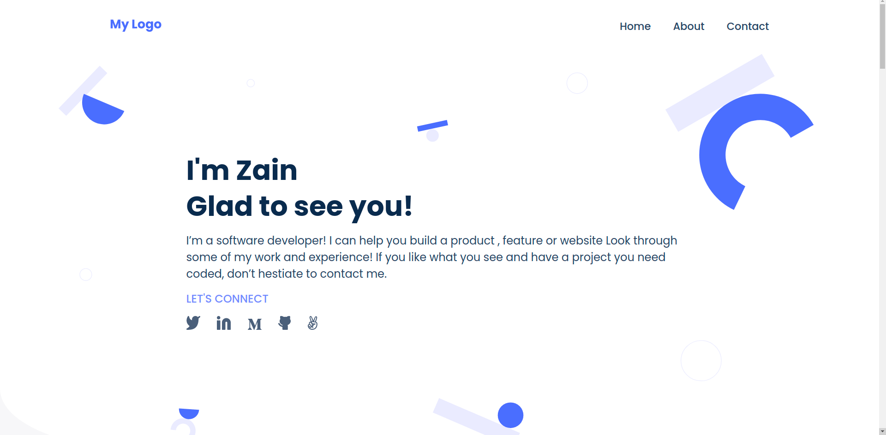
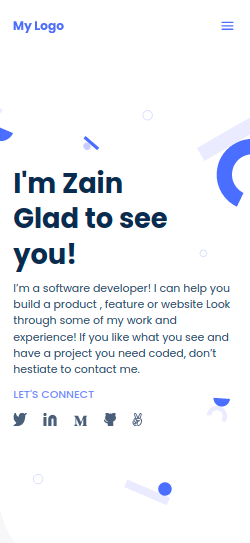
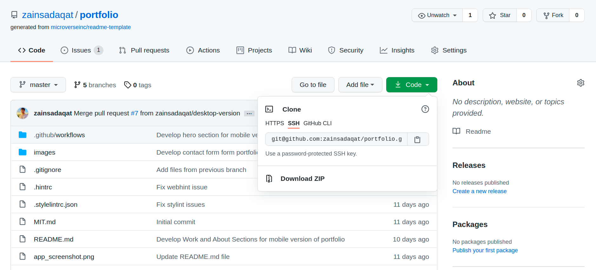
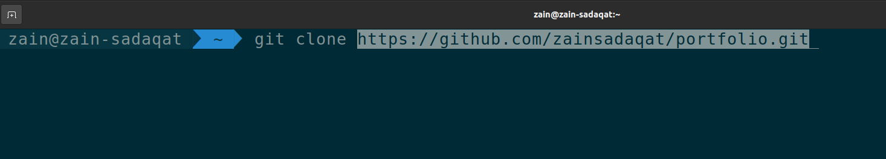

# Portfolio

> Hey, My name is Zain, Glad to see you. This is my Portfolio Website.

Additional description about the project and its features.

## Built With

- HTML5
  - Semantic HTML
- CSS3
  - Flexbox
  - CSS Grid
  - Media Queries
  - Transitions
  - Animations
  - Keyframes

## Getting Started

> To get a local copy up and running follow these simple example steps.

### Prerequisites

- You need a code editor ( _ VS Code Recommended _ ) and git installed on your machine.

### Setup

- Go to Code and Copy the link
  
- Go to Terminal and type "git clone paste-the-repository-link-that-you-copied"
  
- cd project-name
- run the index.html file in your favourite browser ( _ Google Chrome Recommended ;) _ )

### Usage

- Project will be open in Desktop view but if you want to check in the mobile view then press
  ctrl + shift + i or right click and select the inspect option and click the mobile icon available
  on left side of the chrome inspector tool and If you're using firefox it's available on left side.

## Author

👤 **Zain Sadaqat**

- GitHub: [@ZainSadaqat](https://github.com/zainsadaqat)
- Twitter: [@ZainSadaqat](https://twitter.com/zain_sadaqat)
- LinkedIn: [@ZainSadaqat](https://linkedin.com/in/zainsadaqat)
- Instagram: [@ZainSadaqat](https://instagram.com/zain__sadaqat)

## 🤝 Contributing

Contributions, issues, and feature requests are welcome!

Feel free to check the [issues page](../../issues/).

## Show your support

Give a ⭐️ if you like this project!

## 📝 License

This project is [MIT](./MIT.md) licensed.
