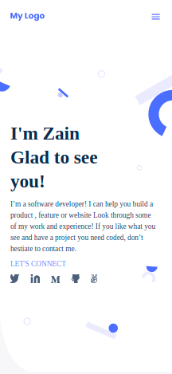

# Portfolio

> Hey, My name is Zain, Glad to see you. This is my Portfolio Website.

Additional description about the project and its features.

## Built With

- HTML & CSS ( Flexbox )

## Getting Started

> To get a local copy up and running follow these simple example steps.

### Prerequisites
* You need a code editor and git

### Setup
* Go to Code and Copy the link
* Go to Terminal and type "git clone paste-the-link-that-you-copied"
* cd project-name

### Install

### Usage

### Deployment

## Author

👤 **Zain Sadaqat**

- GitHub: [@githubhandle](https://github.com/zainsadaqat)
- Twitter: [@twitterhandle](https://twitter.com/zain_sadaqat)
- LinkedIn: [LinkedIn](https://linkedin.com/in/zainsadaqat)

## 🤝 Contributing

Contributions, issues, and feature requests are welcome!

Feel free to check the [issues page](../../issues/).

## Show your support

Give a ⭐️ if you like this project!

## Acknowledgments

- Hat tip to anyone whose code was used
- Inspiration
- etc

## 📝 License

This project is [MIT](./MIT.md) licensed.
